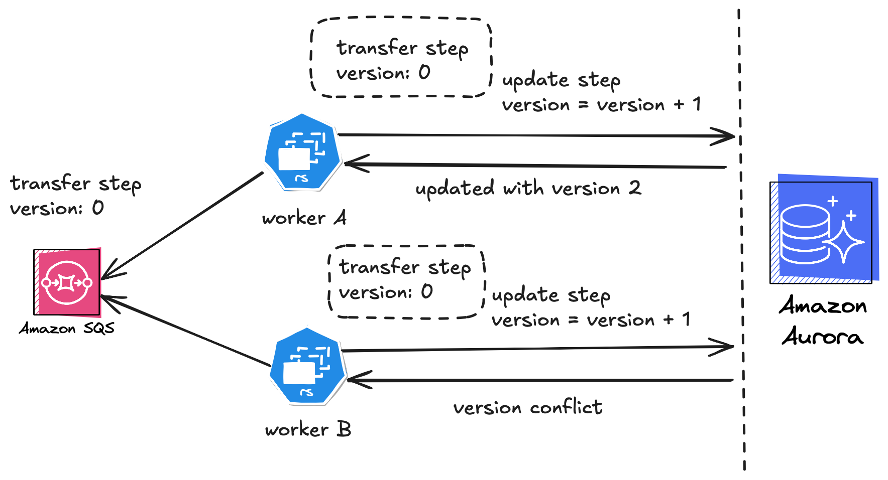

# Idempotency Barrier

A proof-of-concept implementation of an idempotency barrier using a relational database (PostgreSQL) to coordinate 
execution in a distributed system. This repo demonstrates how to enforce at-most-once execution semantics using 
optimistic locking via versioned entities — avoiding the need for external distributed locks like Redis.

## 🧠 Concept

This implementation shows how to use our existing domain model and persistence layer to enforce idempotency. It ensures 
that only one execution for a given key proceeds at a time — others are either blocked or skipped. Retries are allowed
after the lock expires and the lock timeouts are configurable.

This pattern is ideal for our system where the idempotency logic is tied to domain state — such as processing webhook 
events, transfers, or jobs — and avoids the complexity of managing external locks or lock timeouts.

